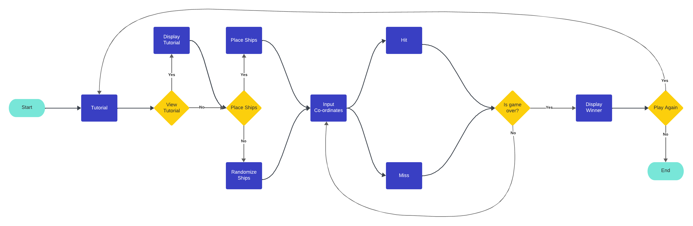

# Battleships

Battleships is a terminal-based python game in which the player and the computer take turns attacking each others ships on selected co-ordinates.

## Demo

A live demo of the project can be found here:

https://chriscsms-battleships-1a8672cefa30.herokuapp.com/

- - -

## Contents

* [How to Play](#how-to-play)
* [User Experience](#user-experience-ux)
* [Design](#design)
* [Features](#features)
* [Technologies Used](#technologies-used)
* [Deployment and Local Development](#deployment-and-local-development)
* [Testing](#testing)
* [Credits](#credits)

- - -

## How to Play

Battleships is a re-creation of the Battleships board game. 

At the beginning of the game, the player has the option of either placing their ships or randomizing their board layout. The computers board is randomly generated. 

The player and the computer take turns inputting co-ordinates to attack each others ships. The player can't see the computers ship placement and the computer attacks are random. 

Ships are indicated with the "@" symbol, misses are indicated with "X" and hits are indicated with "*". Co-ordinates that have not been inputted are indicated with "-".

The first to sink their opponents ships is the winner.

# User Experience (UX)

## Initial Discussion

Create a terminal-based Python game.

### Key Information

* What is the games concept?
* What are the capabilities allowed with Python?
* What are the gameplay mechanics?

## User Stories

### First Time Visitor Goals

* I want to learn the controls easily.
* I want to understand the UI being displayed.

## Returning Visitor Goals

* I want to continue where I stopped playing before. 
* I want to find out something new within the game.

## Frequent Visitor Goals 

* I want to check for any new or updated gameplay. 
* I want to complete the game.

# Design 

## Colour Scheme

The colour scheme chosen is blue, red and white which reflect the colours used in the original board game.

## Flowchart

- - -

# Features

The webpage for the game is composed of a terminal window and a run program button.

### Terminal Window/Game Start

The game begins with displaying an ASCII logo for the games title. And gives players the option of viewing the tutorial.

### Tutorial

The tutorial is displayed using an ASCII box with contained text. 

### Placing Ships

The player has the option to place their own ships on their board by inputting co-ordinates.

### Board Display

The game begins after the ships have been placed. The player and the computers boards are displayed to the terminal with the computers ship placement being hidden from the player. The player is prompted to enter a co-ordinate.

### Input Validation

The validation ensures the player has entered a valid co-ordinate, and that it is in the correct format.

### Game End

After the player or the computer has sunk all their opponents ships the winner message is displayed and the player has the option of playing again.

- - - 

## Future Implementations

* A way of recording data that would allow players to continue where they left off.
* Language options for the game.
* Larger board sizes.
* More than one opponent.

# Technologies Used 

## Languages Used

Python is the main language used to build this game and project.

## Frameworks, Libraries and Programs Used

* Git - For version control.
* Github - To save and store files for the website.
* Visual Studio Code - For writing the code.
* Am I Responsive? - To view the website on different devices as an image.
* Heroku - For deploying the project to a live page.

# Deployment and Local Development

## Deployment

The site is deployed using Heroku CLI

1. Login or Signup to Heroku.
2. Create a new app from the dashboard, give it a suitable name and select the appropriate region and the click create app.
3. Navigate to the settings after your app has been created.
4. Click on reveal config vars (For this app add a config var of KEY = PORT:VALUE = 8000). 
5. Scroll down to buildpacks and add Python and then NodeJS. 
6. Return to the nav and select the deploy option.
7. Scroll down to the deployment method and select Github then input the appropriate repository connected to this project.
8. You can now manually deploy or enable automatic deploys. (This project uses automatic deploys.)  

## Local Development

### How to Fork
- - -
To fork this repository:

1. Login or Signup to GitHub. 
2. Go to the repository for the project, https://github.com/ChrisCSMS/battleships.
3. Click the fork button in the top-right corner.

### How to Clone
- - -
To clone this repository:

1. Login or Signup to GitHub. 
2. Go to the repository for the project, https://github.com/ChrisCSMS/battleships.
3. Click on the code button, select which option to clone with, HTTPS, SSH or GitHub CLI and copy the link.
4. Open the terminal in your code editor and change the current working directory location to a new one for the copied directory.
5. Type git clone into the terminal followed by the link copied in step 3 and press enter.
- - - 

# Testing 

Visual Studio Code's built-in terminal was used to test the code.

## Automated Testing

The code was passed through the Code Institute Python Linter without any errors.

## Manual Testing 

As a user:

* Page loads and everything is visible.
* Buttons are responsive to being clicked. 
* Buttons give the appropriate and expected response.
* Text is clear and readible.
* Inputs work as intended.
* Validates for incorrect inputs.

- - -

# Credits

## Content 

All content was written by myself.

## Acknowledgements

I would like to acknowledge the help I recieved in developing this project.

* Slack Community, for advice and recommendations.
* W3Schools for their helpful tutorials. 
* Code Institute Love Maths project which prepared me for this project. 

